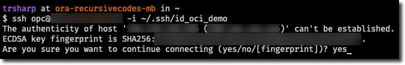

This article was inspired by an article on the Oracle dev blog about [setting up a free Minecraft server](https://blogs.oracle.com/developers/post/how-to-set-up-and-run-a-really-powerful-free-minecraft-server-in-the-cloud) :)

Create your free Oracle Cloud Account [here](https://www.oracle.com/cloud/free/) to get started! It may take a few days for the account to be confirmed. I eventually received a phone call confirming my account and was able to get started after that.

## Creating an Always Free VM

Much of this section is "borrowed" from the Minecraft article on the Oracle dev blog.

Log into your free account and get started by Creating a VM instance.

   

Give your VM instance a name (the example from Oracle is “minecraft-server") and choose a “compartment”. Compartments are just a way to group different things together. You can just leave the default (“root”) compartment selected. 

Also, choose an “availability domain”, preferably one close to where you are geographically - but, it shouldn't matter too much. (You may need to change the availability domain if you can't find the Ampere Arm shape)


Next, find the Image and Shape section, select Oracle Linux 8.4 and then click "change shape"


In the shape dialog, select the 'Instance type' of ‘Virtual Machine’ and then select ‘Ampere’ (ARM) under ’Shape series’. Choose the ‘VM.Standard.A1.Flex’ shape and choose the amount of CPU and RAM that you want to allocate to this server. For your “always free” ARM servers, you get up to 4 OCPU and 24 GB of RAM to allocate. This means that you can turn up one virtual machine with 4 OCPU and 24GB of RAM, or 4 servers each with 1 OCPU and 6GB of RAM (or any combination up to the limit). 

For the sake of this tutorial you can create your virtual machine with 4 OCPU and 24GB of RAM.


Double check that the Always Free Eligible tag is visible for your selected shape.


Next, we’ll need to choose a virtual cloud network (VCN). If you already have an existing VCN with a public subnet, choose that. If not, select ‘Create a new virtual cloud network’. Then, choose ‘Create a public subnet’ and accept the default names. Finally, make sure that ‘Assign a public IPv4 address’ is selected (otherwise you couldn’t connect to this server from the internet!).


Now we need to associate an “SSH” key pair with this VM. If you’re familiar with this concept and already have a public key that you want to use, choose ‘Upload public key files’ and upload your public key. If you’re not familiar with this, think of these keys as a unique set of identifiers that allow you to securely log in to your server. Click ‘Generate SSH key pair’ and save your private and public keys to your local machine. We’ll use these in just a bit to log in to the VM.


Finally click "Create" and you will be redirected to the VM details page. In a few minutes, your VM will be up and running. Take note of your public IP!


Finally connect to your VM using SSH. It may take a couple more minutes after the VM has started to accept the connection, so be patient.



## Installing Docker packages

You may need to run the following commands with sudo..

Install Docker:
```bash
sudo dnf install -y dnf-utils zip unzip
sudo dnf config-manager --add-repo=https://download.docker.com/linux/centos/docker-ce.repo

sudo dnf remove -y runc 
sudo dnf install -y docker-ce --nobest
```

Start the docker service now and enable it so it runs on boot:
```bash
sudo systemctl enable docker.service --now
```

Check the status of the docker service:
```bash
systemctl status docker.service
sudo docker info
sudo docker version
```

run hello world!
```bash
sudo docker run hello-world
sudo docker images hello-world
```

Create the docker group. The docker group will give members the privelege to run docker commands without sudo. This is equivalent to having priveleges of the root user, but will be necessary for the next step.

```bash
sudo groupadd docker
sudo usermod -aG docker $USER
```

Restart the VM and reconnect

run hello world again without sudo!
```bash
docker run hello-world
docker images hello-world
```

Finally install Docker Compose: following the instructions at the [Github Repo](https://github.com/docker/compose). (The docker site instructions are out of date for Linux install)
## Getting Nakama Docker Compose Configs

Familiarize yourself with Nakama deployment basics at their [site](https://heroiclabs.com/docs/nakama/getting-started/docker-quickstart/).

Create a nakama directory to hold the files in your $HOME directory.
```
[opc@ashtronaut-vm nakama]$ pwd
/home/opc/nakama
[opc@ashtronaut-vm nakama]$ ls docker-compose.yml 
docker-compose.yml
```
Try running `docker compose up`. It will fail because you need to make some changes to the docker-compose.yml that they provide in order to run on Arm. Not only that, but Nakama does not provide an ARM image, but since it is Open Source, their Dockerfile is available in the public repo, and we can build our own!

## Necessary Config Changes
Change the [cockroachDB image](https://hub.docker.com/r/christoofar/cockroachdb-arm64). Note that you could also build your own, but at the time of writing, this is a fairly recent build.
```yml
# /home/opc/nakama/docker-compose.yml
version: '3'
services:
  cockroachdb:
    image: christoofar/cockroachdb-arm64
# ...
```

Change the [Prometheus image](https://hub.docker.com/r/prom/prometheus-linux-arm64).
```yml
# /home/opc/nakama/docker-compose.yml
services:
# ...
  prometheus:
    image: christoofar/cockroachdb-arm64
# ...
```

Build your own Nakama image!
Clone the [Nakama public repository](https://github.com/heroiclabs/nakama) into the your current directory. `pwd` should show as /home/opc/nakama/nakama/build.
```bash
git clone https://github.com/heroiclabs/nakama.git
cd nakama/build
pwd
```

edit build/Dockerfile. Find the line with `ENV GOARCH amd64` and change the value to `ENV GOARCH arm64`. Next run the build with the latest release version.
```bash
docker build "$PWD" --build-arg commit="$(git rev-parse --short HEAD)" --build-arg version=v3.2.1 -t heroiclabs/nakama:3.2.1-arm64

```

Finally edit your docker-compose to use your new docker image! It will already be stored with docker.
```yml
# /home/opc/nakama/docker-compose.yml
services:
# ...
  nakama:
    image: heroiclabs/nakama:3.2.1-arm64
# ...
```

After you can successfully run `docker compose up`, Try replacing the default security keys and passwords values using a config like provided [here](https://heroiclabs.com/docs/nakama/getting-started/docker-quickstart/#configuration-file) also see https://heroiclabs.com/docs/nakama/getting-started/docker-quickstart/#configuration-file for reference.
```yml
# /home/opc/nakama/docker-compose.yml
services:
# ...
  nakama:
    image: heroiclabs/nakama:3.2.1-arm64
    entrypoint:
      - "/bin/sh"
      - "-ecx"
      - >
        /nakama/nakama migrate up --database.address root@cockroachdb:26257 &&
        exec /nakama/nakama --config /nakama/data/full-config.yml --database.address root@cockroachdb:26257 --logger.level DEBUG --session.token_expiry_sec 7200 --metrics.prometheus_port 9100
```
## Run on Boot via Systemd


Write a systemd service file that will run your docker compose script on boot!
```ini
# /etc/systemd/system/docker-compose-app.service

[Unit]
Description=Docker Compose Application Service
Requires=docker.service
After=docker.service

[Service]
Type=oneshot
RemainAfterExit=yes
User=opc
WorkingDirectory=/home/opc/nakama/
ExecStart=/usr/bin/docker compose up -d
ExecStop=/usr/bin/docker compose down
TimeoutStartSec=0

[Install]
WantedBy=multi-user.target
```

enable the service to run on boot!
```bash
sudo systemctl enable docker-compose-app
```

Restart your VM  and check the status of your service:
```bash
systemctl status docker-compose-app
# view logs
journalctl -xeu docker-compose-app
```

## Setting up VCN Firewall Rules

Finally return to the Oracle Cloud dashboard and navigate to your VM details page. Click on the VCN subnet then select the security list and you will be taken to the correct page for adding ingress and egress rules. These will allow data to flow in and out of your VM.
Create ingress and egress rules for the ports that you specified in your configuration. I will just add TCP rules, but if you plan on using UDP you should add rules for those as well.


That's it, you're done! Try following https://heroiclabs.com/blog/tutorials/godot-fishgame/ and use your public IP and your secret key when working through the tutorial. Try sharing a lobby with a friend :)

## Future Goals

There is so much more that can be done with Nakama. You can proxy the server, for example. And it is intended to be run as a cluster. A future post could demonstrate the steps for deploying an auto-scaling cluster on AWS, GCP, or Oracle Cloud! For now I am just doing simple development and testing, so the free Oracle VM will be suitable for me :)

